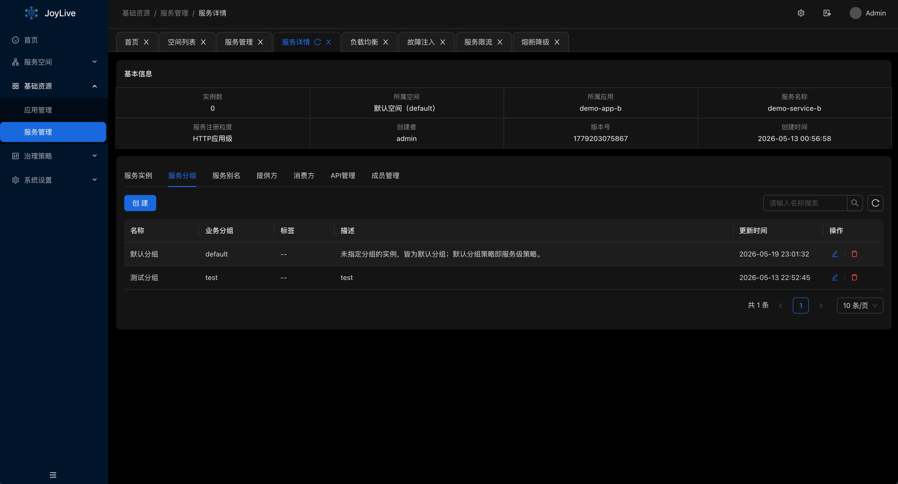
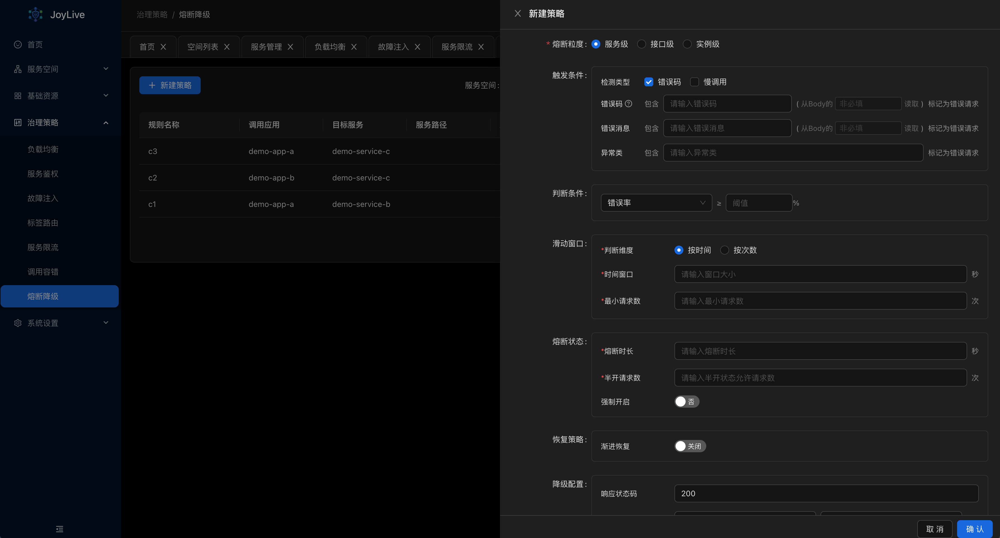
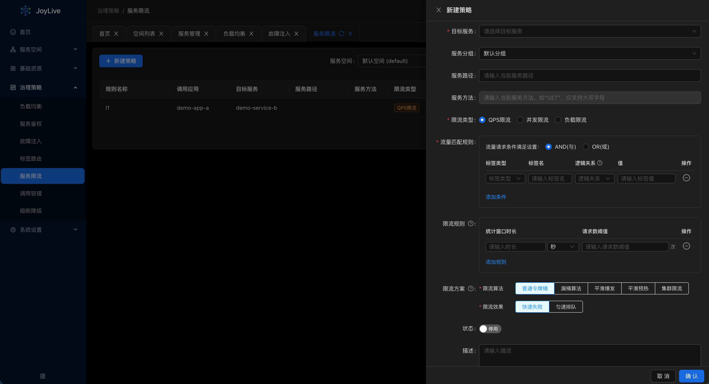
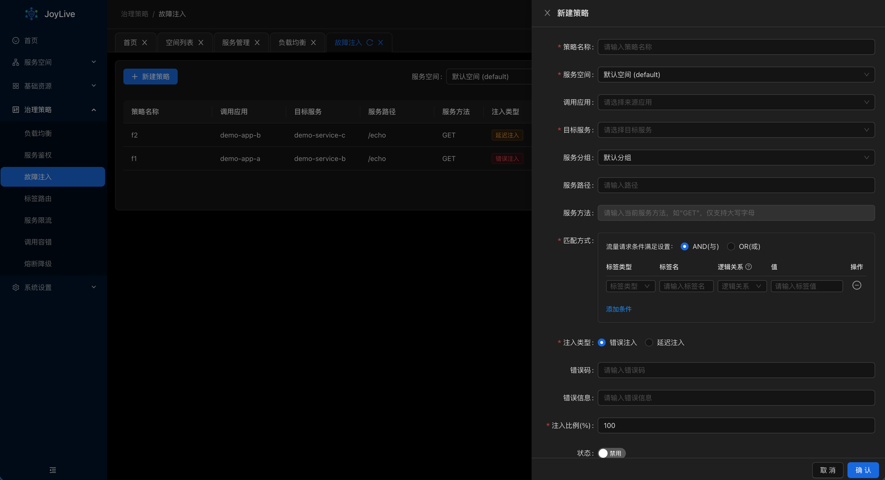

<div align="center">
  <a href="https://github.com/jd-opensource/joylive-dashboard">
    
  </a>
  <br>
  <br>

[](LICENSE)

  <h1>JoyLive-Dashboard</h1>
</div>

> [中文文档](README-zh.md)
>
> 🌐 **Live Demo**: [http://152.70.241.41:8040](http://152.70.241.41:8040)
> 👤 **Default Credentials**: `admin` / `admin`

## Introduction

A microservice governance console serving [joylive-agent](https://github.com/jd-opensource/joylive-agent).

### Dashboard
Real-time monitoring overview of microservice instances and overall system health.


### Service List
View and manage all connected microservices, with quick access to route and gateway configuration.


### Service Details
Drill into individual service details to inspect instance registration and health status across environments and swimlanes.


### Circuit Breaker Policies
Configure automatic circuit-breaking policies for faulty dependencies, with flexible metric dimensions to prevent cascading failures.


### Rate Limiting Policies
Flexible server-side and client-side rate limiting controls and protection strategies for traffic spikes.


### Fault Injection
Simulate network delays or system failures to strengthen high-availability resilience of your microservice architecture.


## Project Structure

This project uses an integrated frontend-backend architecture:

- **Frontend**: Vue 3 + Vite + Ant Design Vue
- **Backend**: Go + Gin + GORM
- **Deployment**: Multi-stage Docker build, single image containing both frontend and backend

```
joylive-dashboard/
├── frontend/          # Frontend Vue project
├── internal/          # Backend Go code
├── configs/           # Configuration files
├── cmd/               # CLI commands
├── main.go            # Application entry point
├── Makefile           # Build scripts
├── Dockerfile         # Docker build configuration
└── docker-compose.yml # Docker Compose configuration
```

## Quick Start

### Local Development

#### 1. Prerequisites

Make sure you have the following installed:

- Go 1.19+
- Node.js 18+
- MySQL 5.7+
- Redis 6.0+

#### 2. Configure Database

Create the database `joylive_dashboard`:

```sql
CREATE DATABASE joylive_dashboard CHARACTER SET utf8mb4 COLLATE utf8mb4_unicode_ci;
```

#### 3. Build and Run

```bash
# Build frontend and backend
make build-all

# Start the server
make serve
```

#### 4. Access

Open your browser and navigate to `http://localhost:8040`. Default admin credentials:

- Username: `admin`
- Password: `admin`

### Docker Deployment

#### 1. Build Image

```bash
# Option 1: Using Makefile
make docker-build

# Option 2: Using script
./scripts/deploy.sh v1.0.0
```

#### 2. Run Container

```bash
# Option 1: Using Docker Compose (recommended)
docker-compose up -d

# Option 2: Manual run
docker run -d -p 8040:8040 --name joylive joylivedashboard:latest
```

#### 3. Access the Application

Open your browser and navigate to `http://localhost:8040`

## Build Commands

```bash
# Build frontend
make build-frontend

# Build backend
make build

# Build frontend and backend
make build-all

# Build Docker image
make docker-build

# Build and push image
make docker-push

# Clean build artifacts
make clean
```

## Configuration

### Environment Configuration

- `frontend/.env.dev` - Development environment
- `frontend/.env.prod` - Production environment

### Backend Configuration

Configuration files are located in the `configs/` directory:

- `dev/` - Development environment configuration
- `prod/` - Production environment configuration

## Deployment Architecture

```
┌─────────────────────────────────────┐
│         Docker Container            │
│  ┌─────────────┐  ┌─────────────┐  │
│  │   Frontend  │  │   Backend   │  │
│  │  (Vue + Vite)│  │   (Go + Gin)│  │
│  └─────────────┘  └─────────────┘  │
│         │                │          │
│         └────────┬───────┘          │
│                  │                  │
│           Static Files              │
│              Serving                │
└─────────────────────────────────────┘
                    │
                    ▼
            Port 8040
```

## FAQ

### Q: How do I change the frontend API endpoint?

Modify `VITE_API_HTTP` in `frontend/.env.prod`, then rebuild.

### Q: How do I persist data?

When using Docker Compose, data is automatically mounted to the `./data` directory.

### Q: How do I view logs?

```bash
# Docker Compose
docker-compose logs -f joylive

# Docker
docker logs -f joylive
```

## Development Guide

### Frontend Development

```bash
cd frontend
npm install
npm run dev
```

### Backend Development

```bash
make start
```

### Code Generation

```bash
# Generate Swagger docs
make swagger

# Generate Wire dependency injection
make wire
```

## Related Projects

1. [joylive-injector](https://github.com/jd-opensource/joylive-injector) — A component to automatically inject `joylive-agent` in cloud-native environments.

2. [joylive-agent](https://github.com/jd-opensource/joylive-agent) — A Java microservice governance data-plane agent based on bytecode enhancement.

3. [joylive-control-plane](https://github.com/jd-opensource/joylive-control-plane) — A microservice governance policy for `joylive-agent` to distribute control surface.

## License

This project is licensed under the Apache License. See the [LICENSE](LICENSE) file for details.
