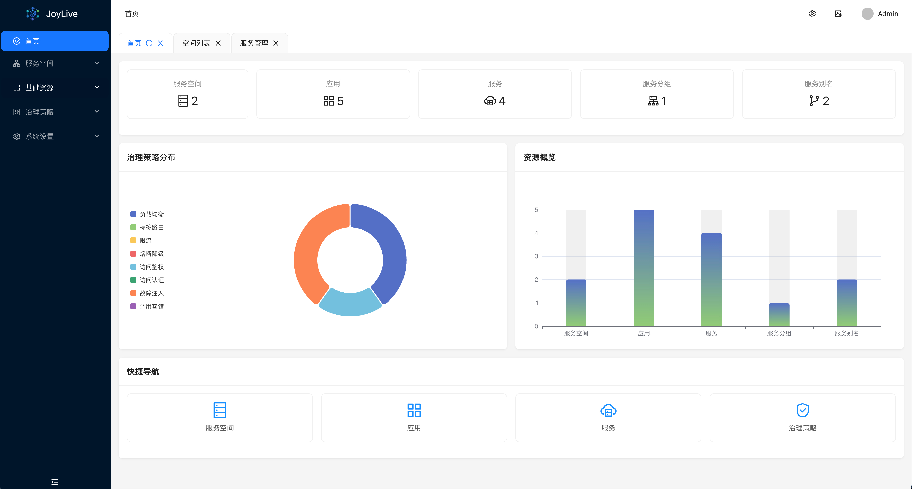
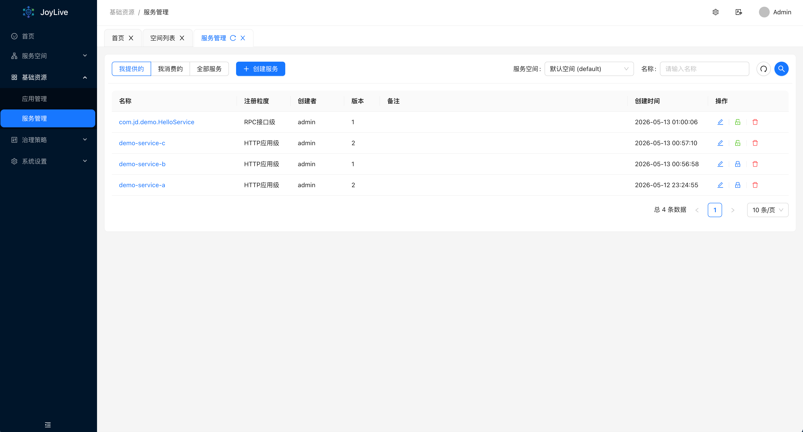

<div align="center">
  <a href="https://github.com/jd-opensource/joylive-dashboard">
    
  </a>
  <br>
  <br>

[](LICENSE)

  <h1>JoyLive-Dashboard</h1>
</div>

A microservice governance interface operation console serving joylive-agent. 一个服务于joylive-agent的微服务治理界面操作控制台。





## 项目结构

本项目采用前后端一体化架构：

- **前端**：Vue 3 + Vite + Ant Design Vue
- **后端**：Go + Gin + GORM
- **部署**：Docker多阶段构建，单一镜像包含前后端

```
joylive-dashboard/
├── frontend/          # 前端Vue项目
├── internal/          # 后端Go代码
├── configs/           # 配置文件
├── cmd/               # CLI命令
├── main.go            # 程序入口
├── Makefile           # 构建脚本
├── Dockerfile         # Docker构建配置
└── docker-compose.yml # Docker Compose配置
```

## 快速开始

### 本地开发

#### 1. 准备工作

确保你已经安装了以下软件：

- Go 1.19+
- Node.js 18+
- MySQL 5.7+
- Redis 6.0+

#### 2. 配置数据库

创建数据库 `joylive_dashboard`：

```sql
CREATE DATABASE joylive_dashboard CHARACTER SET utf8mb4 COLLATE utf8mb4_unicode_ci;
```

#### 3. 构建并运行

```bash
# 构建前端和后端
make build-all

# 启动服务
make serve
```

#### 4. 访问

打开浏览器访问 `http://localhost:8040`，默认管理员账号：

- 用户名：`admin`
- 密码：`admin`

### Docker部署

#### 1. 构建镜像

```bash
# 方式一：使用Makefile
make docker-build

# 方式二：使用脚本
./scripts/deploy.sh v1.0.0
```

#### 2. 运行容器

```bash
# 方式一：使用Docker Compose（推荐）
docker-compose up -d

# 方式二：手动运行
docker run -d -p 8040:8040 --name joylive joylivedashboard:latest
```

#### 3. 访问应用

打开浏览器访问 `http://localhost:8040`

## 构建命令

```bash
# 构建前端
make build-frontend

# 构建后端
make build

# 构建前端和后端
make build-all

# 构建Docker镜像
make docker-build

# 构建并推送镜像
make docker-push

# 清理构建产物
make clean
```

## 配置说明

### 环境配置

- `frontend/.env.dev` - 开发环境
- `frontend/.env.prod` - 生产环境

### 后端配置

配置文件位于 `configs/` 目录：

- `dev/` - 开发环境配置
- `prod/` - 生产环境配置

## 部署架构

```
┌─────────────────────────────────────┐
│         Docker Container            │
│  ┌─────────────┐  ┌─────────────┐  │
│  │   Frontend  │  │   Backend   │  │
│  │  (Vue + Vite)│  │   (Go + Gin)│  │
│  └─────────────┘  └─────────────┘  │
│         │                │          │
│         └────────┬───────┘          │
│                  │                  │
│           Static Files              │
│              Serving                │
└─────────────────────────────────────┘
                    │
                    ▼
            Port 8040
```

## 常见问题

### Q: 如何修改前端API地址？

修改 `frontend/.env.prod` 中的 `VITE_API_HTTP` 配置，然后重新构建。

### Q: 如何持久化数据？

使用Docker Compose时，数据会自动挂载到 `./data` 目录。

### Q: 如何查看日志？

```bash
# Docker Compose
docker-compose logs -f joylive

# Docker
docker logs -f joylive
```

## 开发指南

### 前端开发

```bash
cd frontend
npm install
npm run dev
```

### 后端开发

```bash
make start
```

### 代码生成

```bash
# 生成代码
make gen-code-config

# 生成Swagger文档
make swagger

# 生成Wire依赖注入
make wire
```

## 许可证

本项目采用 Apache 许可证，详情请查看 [LICENSE](LICENSE) 文件。
